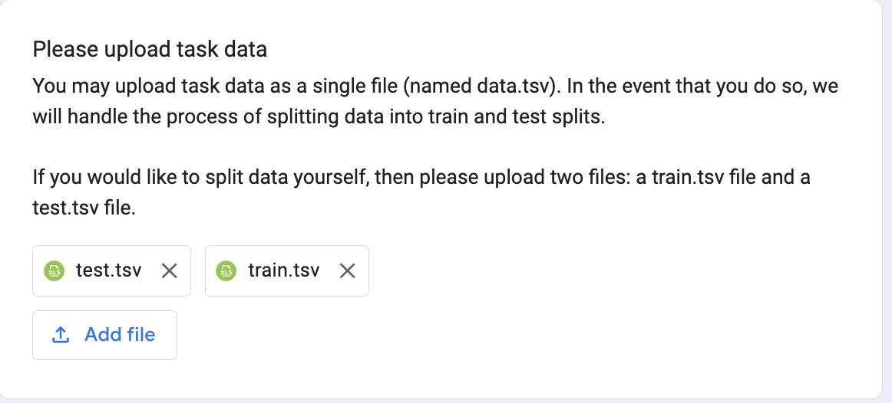

# Example Submission: Hearsay

We walk through the process of submitting a task, using the [Hearsay](https://github.com/HazyResearch/legalbench/tree/main/tasks/hearsay) as an example.

## Designing the task

We modeled the Hearsay task on the types of hypotheticals that a law student would be asked in a law school course on Evidence. The rule for hearsay dictates that "out-of-court statements introduced to prove the truth of the matter asserted" are inadmissible as evidence. Course questions testing the hearsay rule usually provide a brief description of a legal issue and a piece of evidence. The student is tasked with determining if that evidence---in the context of the issue---constitutes hearsay.

## Dataset construction

We constructed this task by manually generating fact patterns to test the hearsay rule. All our fact patterns are intended to have an obvious answer---there are no close calls or subjectivity here. We manually generated 100 such fact patterns, used 5 as train samples, and the remaining 95 as test samples. An example of a fact pattern is provided below:

```text
On the issue of whether Rebecca was ill, the fact that Rebecca told Ronald that she was unwell.
```

Our [train](https://github.com/HazyResearch/legalbench/blob/main/tasks/hearsay/train.tsv) and [test](https://github.com/HazyResearch/legalbench/blob/main/tasks/hearsay/test.tsv) files are formatted as tab-separated value files. If you construct data manually in Google Sheets or Excel, then it's possible to export the file as a TSV.

## Prompt Construction

Our prompt for this task follows a very simple template, in which we provide the rule for hearsay first, and then several examples. We append "Is this hearsay?" to every fact pattern.

```text
Hearsay is an out-of-court statement introduced to prove the truth of the matter asserted.

Q: On the issue of whether David is fast, the fact that David set a high school track record. Is there hearsay?
A: No

Q: On the issue of whether Rebecca was ill, the fact that Rebecca told Ronald that she was unwell. Is there hearsay?
A: Yes

Q: To prove that Tim was a soccer fan, the fact that Tim told Jimmy that "Real Madrid was the best soccer team in the world." Is there hearsay?
A: No

Q: When asked by the attorney on cross-examination, Alice testified that she had "never seen the plaintiff before, and had no idea who she was." Is there hearsay?
A: No

Q: On the issue of whether Martin punched James, the fact that Martin smiled and nodded when asked if he did so by an officer on the scene. Is there hearsay?
A: Yes

Q: {{text}} Is there hearsay?
A:
```

## Submitting via Google Forms

Tasks may be submitted via this [form](https://docs.google.com/forms/d/e/1FAIpQLScTlLR0vA2Zd4Vak0yhNOY7dZPXbUy3jzvXkTspE4Qgw5lHxQ/viewform). We step through each step of the form.

First, we enter our name and email.


We then provide the name of the task.


We then provide the name of the license we would like to apply for this task.


Next, we provide a description of the task.


We then provide a description of how the task was constructed.


We then upload the `train.tsv` and `test.tsv` files, which contain the training samples and test samples respectively.



Finally, we include the prompt that should be used.


And then click submit! Neel will then work on integrating the task into the Github, and will follow up with next steps.

## Submitting via pull-request

See [here]() for an example.
