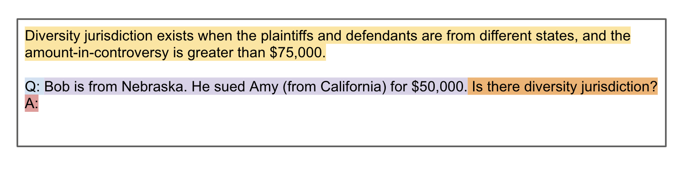

# Prompts

We developed a simple schema for specifying a prompt. This allows us to concisely represent prompt types in yaml configuration files. A prompt consists of all text fed into the model, including in-context samples and the inference sample.

## Prompt elements

In our schema, a prompt can consist of the following elements.

**Introductory statement**: a statement which begins the prompt. This typically defines the task, i.e.,

> <ins>Translate the following from English to French.</ins>  
> Hello, how are you?

It can also define context for the task, such as definitions/rules.
> <ins>Hearsay is an out-of-court statement introduced to prove the truth of the matter asserted.</ins> 
> Bob wrote an email to Mary. Is this hearsay?

**Sample prefixes**: a string prefixed to every sample included in the prompt (both train and test). This is often used to template the model's behavior, and distinguish samples from introductory statements.

> Translate the following from English to French.  
> <ins>English: </ins>Hello, how are you?

**Sample suffixes** a string suffixed to every sample included in the prompt (both train and test). This is often used to template the model's behavior, and distinguish samples from introductory statements.

>Hearsay is an out-of-court statement introduced to prove the truth of the matter asserted. 
> Bob wrote an email to Mary.<ins> Is this hearsay?</ins>

**Label prefix**: a string prefixed to each label. This is also used to prompt the model for an answer.

>Hearsay is an out-of-court statement introduced to prove the truth of the matter asserted. 
> Bob wrote an email to Mary. Is this hearsay? 
> <ins>A:</ins>

**Label**: prompts often contain train samples. We may want to compare different ways of expressing the labels for train samples. By default, we consider the label column to contain the label. However, we can also specify a label via a path to a text file where each line contains the label corresponding to the sample in the same line of the train file.

The screenshot below presents an example of different prompt elements.

Above, the rule statement is shaded in yellow, the sample prefix is shaded in blue, the sample text is shaded in purple, and the sample suffix is shaded in orange, and the label prefix is shaded in red.

## Adding a prompt

To submit a new prompt, create a pull request with a yaml file corresponding to the prompt. Alternatively, email Neel Guha (nguha@stanford.edu) with a description of your prompt, and he will manually add it.

