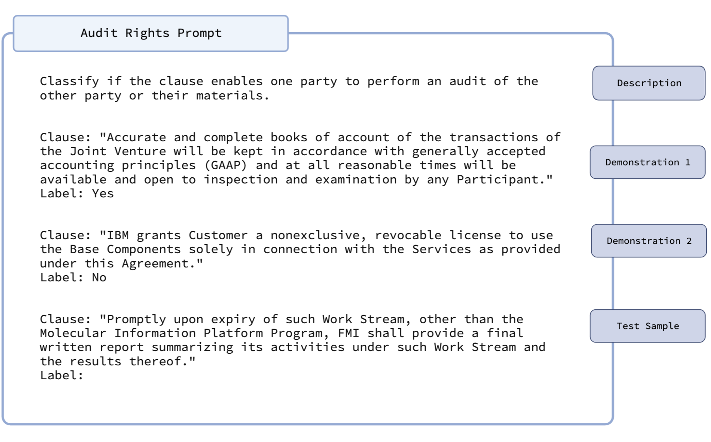

# Prompting: A Primer for Large Language Models

## What is prompting?
Traditionally, developing a machine learning model to perform a task required trained the model on a large annotated dataset corresponding to that task. For domains like law, this type of labeling is often [cost-prohibitive](https://arxiv.org/abs/2103.06268).

In contrast, modern large language models (LLMs) can learn new tasks from mere descriptions of the task. These descriptions are often referred to a "prompts." The ability to learn new tasks from fundementally alters the way in which domain experts (e.g. lawyers) will engage with the process of developing legal ML systems. Instead of ardously manually labeling thousands of samples for training, the expert can focus on crafting and refining a single prompt (a process known as "prompt engineering").

Most LLMs are autoregressive. Given a sequence of text, the LLM will generate a token it has learned is most likely to occur next. The token it generates will depend both on the corpus the LLM was trained on, and any patterns in the sequence provided. The idea behind prompting is if we want to turn a LLM to into a task specific model, we can feed the LLM sequences of text (i.e. prompts), and treat the generated output as the LLM's prediction for the task. The key then, is to design a prompt that contains the text we want to classify, and induces the LLM to output a token corresponding to the correct class for this text.

A well-crafted prompt often consists of three elements. First, the prompt contains a **description** of the task. The purpose of the description is to provide the model with a definition of the task, and instruct it on the label it should assign to samples. Second, the prompt will contain several **demonstrations** of the outputs the model should generate for different inputs. These demonstrations serve multiple purposes. First, they guide the model on the type of outputs that should be generated. For instance should the model generate a simple "Yes"/"No", or should it generate an explanation? Second, the demonstrations offered can help guide the model in performing the task. Finally, the prompt should contain the text that the expert wishes to classify (the **test sample**).


## Example: Classifying Audit Rights

To illustrate how prompting works we'll use the [Audit Rights task]() as an example. The goal of this task is to determine whether a clause creates the right for a party to audit the books, records, or physical premises of a counterparty to ensure compliance with the contract. 

Suppose we wanted to classify the following clause:
```text
"Promptly upon expiry of such Work Stream, other than the Molecular Information Platform Program, FMI shall provide a final written report summarizing its activities under such Work Stream and the results thereof."
```

Using the principles describe above, we can construct the following prompt:



We highlight several aspects of this prompt:

- The description is phrased as an instruction, i.e. "Classify if the clause...". This type of linguistic construction has been found to work well in practice.
- The demonstrations are balanced, in that they provide an example of each possible class (i.e. "Yes" and "No"). In general, providing more demonstrations correlates with better performance.
- The demonstrations have a prefix for the clause ("Clause: ") and the desired output ("Label: "). These prefixes are useful for controlling the LLM output.
- The test sample has the prefixes, but no text after "Label:". Because this is the test sample, we shall use the next token generated by the model as the prediction.


## Prompting in LegalBench
